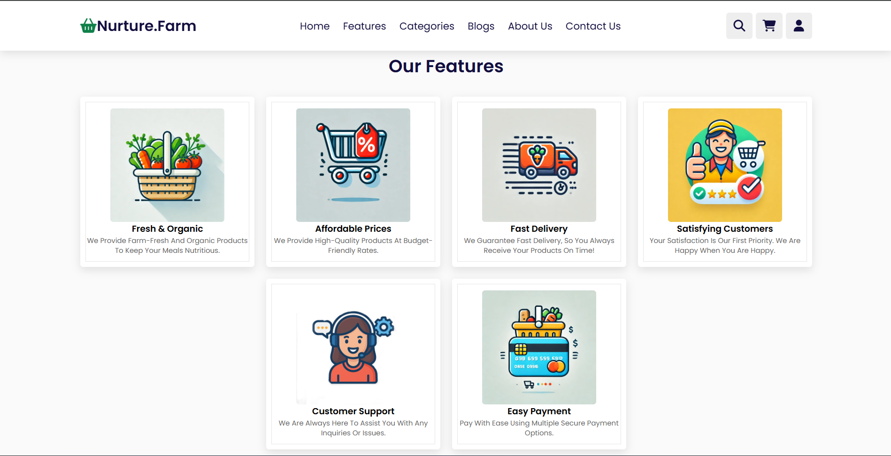
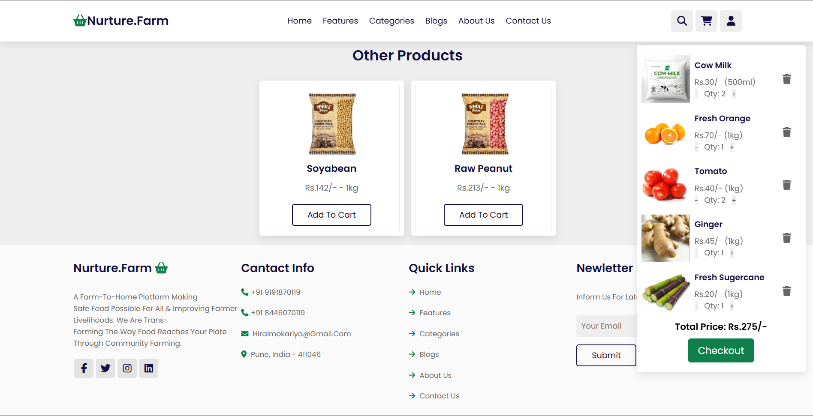
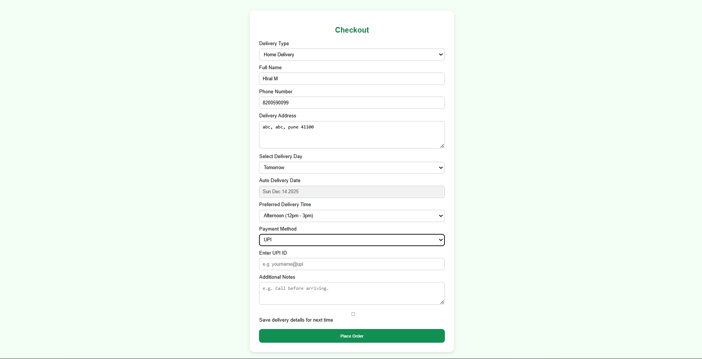
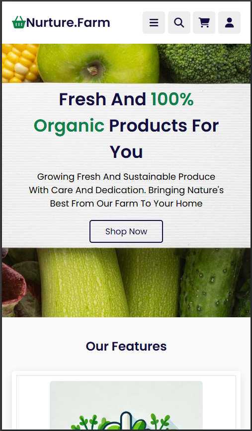

# Nurture.Farm 🌿 - Farm-to-Home Organic E-Commerce Website


[](LICENSE)

A fully responsive static frontend prototype for Nurture.Farm, a farm-to-home e-commerce platform delivering fresh, organic, and sustainable agricultural products directly from farmers to consumers in Pune and surrounding areas.
This project showcases a complete, clean, and user-friendly online marketplace focused on fresh produce, dairy, grains, spices, and more — emphasizing transparency, sustainability, and community farming.

## ✨ Features

- **Home Page Hero**: Welcoming banner highlighting fresh & 100% organic products with "Shop Now" CTA
- **Product Categories**: Grid-based categories (Dairy, Fruits, Vegetables, Spices & Herbs, Grains, Cash Crops, Other Products) with discount badges
- **Features Section**: Highlights key benefits — Fresh & Organic, Affordable Prices, Fast Delivery, Customer Satisfaction, Support, and Easy Payment
- **Product Browsing**: Dedicated sections for various products with images, prices, and "Add to Cart" buttons
- **Shopping Cart & Checkout**: Functional cart with quantity controls, total calculation, and detailed checkout form (delivery details, payment via UPI, notes)
- **Blogs Section**: Informative articles on organic farming, grape farming, cotton success stories, etc.
- **About Us**: Mission statement focusing on sustainable farming and direct farmer-to-consumer connection
- **Contact Us**: Form, contact info (phone, email, address in Pune), quick links, and newsletter subscription
- **Responsive Design**: Fully optimized for mobile, tablet, and desktop with clean layouts and intuitive navigation
- **Static & Lightweight**: Pure HTML/CSS/JS — no backend required for demo

  ## Screenshots

### Desktop View
  

  

  

  

  

  

  

  

### Mobile View
 
 
  

*Clean, responsive design optimized for all devices*

## 🛠️ Tech Stack

**Frontend**
- HTML5 (Semantic structure)
- CSS3 (Custom styling with Flexbox, Grid, and responsive media queries)
- JavaScript (Basic interactivity for cart, forms, and navigation)

**Design Principles**
- Clean, modern UI with green accents for nature/farming theme
- High-quality stock images for products and sections
- Accessible typography and color contrasts
- Smooth user flows for browsing → cart → checkout

## 🚀 Getting Started

### Prerequisites

- Any modern web browser (Chrome, Firefox, Edge, etc.)
- No server or dependencies required!

### Installation

1. **Clone the repository**
```bash
git clone https://github.com/hiral1276/NurtureFarm-responsive-ecommerce-site.git
cd NurtureFarm-responsive-ecommerce-site
```

2. **Open in Browser**
```
- Locate the index.html file in the project folder
- Double-click it to open directly in your default browser
```
Alternatively, use VS Code with the Live Server extension for real-time preview.

## 📁 Project Structure

```
FARM PROJECT/
├── Secrets of Project/          ← Folder (private/backup folder)
├── about us copy.html
├── about us.html
├── astyle.css
├── blogs copy.html
├── blogs.html
├── categories copy.html
├── categories.html
├── checkout.html
├── contact us copy.html
├── contact us.html
├── faq.html
├── features copy.html
├── features.html
├── help.html
├── index copy.html
├── index.html
├── log_reg.html
└── order-success.html

├── css/
│   ├── style copy.css
│   ├── style.css
│   └── team.css

├── js/
│   ├── ascript.js
│   ├── profile-dropdown.js
│   └── script.js

├── image/
│   └── (all images: product photos, banners, icons, etc.)
```

## 🎨 Design Highlights

### Color Scheme
- **Primary**: Green (#28a745) for nature & freshness
- **Text**: Dark for readability
- **Accents**: White background with subtle shadows

### Typography
- Clean sans-serif fonts for modern feel
- Bold headings for emphasis

### UI Components
- Card-based layouts for products/categories
- Forms with clear labels and validation hints
- Buttons with hover effects
- Footer with multi-column info (contact, links, newsletter)

## 📱 Responsive Design

| Device  |      Width     |           Layout                      |
|---------|----------------|---------------------------------------|
| Mobile  | < 768px        | Single column, collapsible navigation |
| Tablet  | 768px - 1024px | 2-column grid                         |
| Desktop | > 1024px       | Multi-column grids, wide layouts      |

## 📊 Measurable Outcomes

✅ Created a complete responsive e-commerce frontend for farm-fresh products

✅ Implemented intuitive shopping flow with cart and UPI checkout

✅ Emphasized sustainability and direct farmer support through design

✅ Designed content-rich sections (blogs, about, contact) for better engagement

✅ Achieved full mobile responsiveness with clean, semantic code

✅ Created a visually appealing, theme-consistent UI focused on sustainability

## 🎯 Use Cases

Perfect for:
- Portfolio showcase demonstrating strong frontend skills in HTML, CSS, and JavaScript
- Learning responsive design principles
- Understanding e-commerce user flows from browsing to checkout
- Practicing clean code organization and semantic HTML structure
- Freelance template for agricultural or organic product websites
- Resume/CV technical project showcase

## 📄 License

This project is licensed under the **MIT License** - see the [LICENSE](LICENSE) file for details.

## 👨‍💻 Author

**Hiralben Mokariya**
- GitHub: hiral1276 (https://github.com/hiral1276)
- LinkedIn: Hiralben Mokariya (www.linkedin.com/in/hiralben-mokariya)
- Email: hiralmokariya12@gmail.com

**Built with ❤️ for sustainable farming and fresh food delivery 🌱🚀**

 

